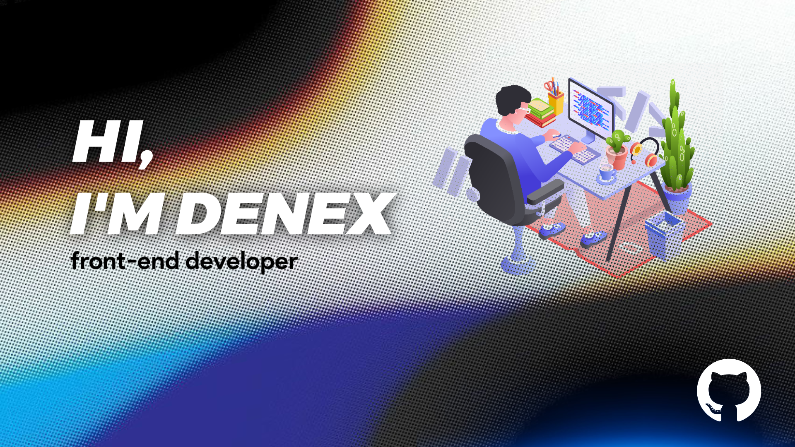

-  I’m currently working on **Web Development**

-  All of my projects are available at [denex](denex.vercel.app)

-  How to reach me **denexdnx5@gmail.com**

<h3 align="left">Connect with me:</h3>

<h3 align="left">Languages and Tools:</h3>

                 

&nbsp;

